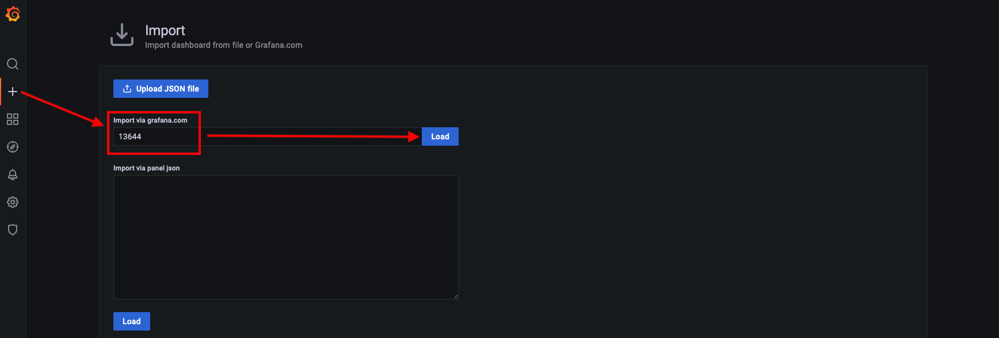

# Jenkins + JMeter + InfluxDB + Grafana

打造具有`极致体验`的`性能测试解决方案`

Tips: 
1. 测试集群采用`Rancher`+`MetalLB`+`NFS Subdir External Provisioner`实现，居家必备；
2. 除上述服务器资源外，还会使用`3`x`10G`的Disk资源作为持久化卷，这里使用家庭`NAS`作为`NFS`服务；

## 一键部署

---

- 一键执行

```shell
kubectl apply -f all-in-one/perf.yaml
```

日志打印如下

```text
namespace/perf-stack created
configmap/grafana created
persistentvolumeclaim/grafana created
deployment.apps/grafana created
service/grafana created
ingress.networking.k8s.io/grafana created
persistentvolumeclaim/influxdb created
deployment.apps/influxdb created
service/influxdb created
ingress.networking.k8s.io/influxdb created
persistentvolumeclaim/jenkins created
deployment.apps/jenkins created
service/jenkins created
ingress.networking.k8s.io/jenkins created
deployment.apps/jmeter-server created
service/jmeter-server created
deployment.apps/jmeter-in-k8s created
```

---

- 查看`Pod`状态

```shell
kubectl get pod -n perf-stack
```

日志打印如下

```text
NAME                             READY   STATUS              RESTARTS   AGE
grafana-697d94fdb8-pgqsx         1/1     Running             0          3m51s
influxdb-66bdff8c9c-6gwpq        1/1     Running             0          3m50s
jenkins-67778bf489-tjh6w         1/1     Running             0          3m50s
jmeter-in-k8s-77948d47d8-99zcc   1/1     Running             0          3m50s
jmeter-server-5dc9866755-cbn4z   1/1     Running             0          3m50s
jmeter-server-5dc9866755-nltcv   1/1     Running             0          3m50s
jmeter-server-5dc9866755-ptkt6   1/1     Running             0          3m50s
```

- 查看`Service`状态

```shell
kubectl get svc -n perf-stack
```

日志打印如下

```text
NAME            TYPE           CLUSTER-IP      EXTERNAL-IP       PORT(S)          AGE
grafana         LoadBalancer   10.43.224.160   192.168.100.150   3000:30167/TCP   6m9s
influxdb        LoadBalancer   10.43.4.226     192.168.100.151   8086:31847/TCP   6m8s
jenkins         LoadBalancer   10.43.187.62    192.168.100.152   8080:30871/TCP   6m8s
jmeter-server   NodePort       10.43.229.221   <none>            1234:31234/TCP   6m8s
```

- 查看`Ingress`状态

```shell
kubectl get ingress -n perf-stack
```

日志打印如下

```text
NAME       CLASS    HOSTS               ADDRESS                                        PORTS   AGE
grafana    <none>   grafana.perf.com    192.168.100.22,192.168.100.23,192.168.100.24   80      8m14s
influxdb   <none>   influxdb.perf.com   192.168.100.22,192.168.100.23,192.168.100.24   80      8m13s
jenkins    <none>   jenkins.perf.com    192.168.100.22,192.168.100.23,192.168.100.24   80      8m13s
```

### 配置域名解析

在 本地`Hosts` 或 组织内的`DNS管理平台` 或 软件`SwitchHosts!` 或 路由器`自定义HOST` 一类的地方配置域名解析即可

```text
192.168.100.22 grafana.perf.com
192.168.100.22 influxdb.perf.com
192.168.100.22 jenkins.perf.com
```

备注: ip随便选哪个都可以~


## 软件设置

---

### InfluxDB

点击[http://influxdb.perf.com/](http://influxdb.perf.com/)

如下图填写您的初始化信息。注意: `Bucket`即后面将会使用到的数据库。


记住这里怎么取Token，待会儿下面会用到。


---

### Grafana

点击[http://grafana.perf.com/](http://grafana.perf.com/)

初始账号密码如下，首次登陆会要求修改密码。注意，记住你修改后的密码哟～

```text
账号: admin
密码: admin
```

添加第一步中配置的InfluxDB数据源。

操作路径: `Configuration(左侧边栏齿轮图标)` -> `Data Sources` -> `InfluxDB(第3个图标)`

如下图进行配置。注意: 集群内Pod之间，这里的URL使用`influxdb:8086`的形式。


导入[官方看板](https://grafana.com/grafana/dashboards/?dataSource=influxdb&search=JMeter)

这里选择`JMeter Load Test (org.md.jmeter.influxdb2.visualizer) - influxdb v2.0 (Flux)`作为数据看板,通过ID`13644`进行导入。




现在，我们还看不到任何数据，所以接下来会练习一个最简单的例子。


---

### JMeter

#### 场景1: 集群外使用

通常在办公网环境使用时，本地(笔记本/PC)JMeter作为节点控制器，远程(服务器集群)工作节点作为施压机，形成多机分布式性能测试架构。


由于需要在集群外独立访问每个远程工作节点，因此可以考虑使用Ingress或NodePort来暴露Pod。

#### 场景2: 集群内使用

架构上和在集群外使用一致，仅仅是网络环境不一样，更推荐在集群内使用。

进入`节点控制器`容器内

```shell
kubectl exec -it $(kubectl get pods -n perf-stack | grep jmeter-in-k8s | awk '{print $1}') -n perf-stack -- /bin/bash
```

执行完会发现已经进入容器的命令行模式

可以使用`pwd`查看一下当前路径

```text
bash-5.1# pwd
/opt/workspace
```

一键执行测试

```shell
make all
```

执行日志如下

```text
bash-5.1# make all
REMOTE HOSTS: 10.42.0.14:1099,10.42.1.24:1099,10.42.2.26:1099
jmeter -Dlog4j2.formatMsgNoLookups=true -Dlog_level.jmeter=DEBUG -Dserver.rmi.ssl.disable=true \
-GTARGET_THREADS=1 \
-GTARGET_PROTOCOL=https -GTARGET_HOST=example.com -GTARGET_PORT=443 \
-GTARGET_PATH=/api \
-GTARGET_DATASET=/opt/workspace/testcases/proj_example/dataset.txt -GTARGET_TEMP_DIR=temp \
-n -t /opt/workspace/testcases/jmx/HelloWorld.jmx -l /opt/workspace/testcases/proj_example/jmeter.jtl -j /opt/workspace/testcases/proj_example/jmeter.log \
-e -o /opt/workspace/testcases/proj_example/report \
-R 10.42.0.14:1099,10.42.1.24:1099,10.42.2.26:1099
...
Created the tree successfully using /opt/workspace/testcases/jmx/HelloWorld.jmx
Configuring remote engine: 10.42.0.14:1099
Configuring remote engine: 10.42.1.24:1099
Configuring remote engine: 10.42.2.26:1099
...
Waiting for possible Shutdown/StopTestNow/HeapDump/ThreadDump message on port 4445
summary +      1 in 00:00:02 =    0.6/s Avg:  1286 Min:  1286 Max:  1286 Err:     1 (100.00%) Active: 3 Started: 3 Finished: 0
summary +    303 in 00:00:28 =   10.6/s Avg:   209 Min:     0 Max:  2890 Err:   303 (100.00%) Active: 2 Started: 3 Finished: 1
summary =    304 in 00:00:30 =   10.1/s Avg:   212 Min:     0 Max:  2890 Err:   304 (100.00%)
summary +    131 in 00:00:01 =  152.3/s Avg:   187 Min:     0 Max:   820 Err:   131 (100.00%) Active: 0 Started: 3 Finished: 3
summary =    435 in 00:00:31 =   14.0/s Avg:   204 Min:     0 Max:  2890 Err:   435 (100.00%)
...
==== jmeter.log ====
...
==== Raw Test Report ====
...
==== HTML Test Report ====
...
See HTML test report in /opt/workspace/testcases/proj_example/report/index.html
```

Tips: 注意这里给各个服务器传递参数的方式

> -Dxxx defines a java system property

> -Jxxx defines a local JMeter property

> -Gxxx defines a JMeter property to be sent to all remote servers

相关路径
1. 报告路径 `testcases/proj_example/report` 打包下载即可
2. 日志路径
   1. 测试日志 `testcases/proj_example/jmeter.jtl`
   2. JMeter日志 `testcases/proj_example/jmeter.log`
   3. 其他日志 `testcases/proj_example/temp`

- Makefile伪目标

```text
all:    依次执行clean、run、report伪目标
clean:  清理目录
run:    执行测试
report: 显示结果
```

#### InfluxDB2 Listener

OK，我们现在使用带`InfluxDB2 Listener`的JMX来尝试一下，以下是配置参数。

注意：当你在集群内部访问时，应该使用`influxdb:8086`，而不是下图设置的`influxdb.perf.com:80`。


执行完测试后，你将会看到下面的效果。[飞机票✈️](http://grafana.perf.com/)


---

### Jenkins

创建Jenkins所使用的`ServiceAccount`

```shell
kubectl apply -f all-in-one/jenkins-sa.yaml 
```

点击[http://jenkins.perf.com/](http://jenkins.perf.com/)

执行以下命令来查询Jenkins的`初始管理密码`

```shell
kubectl logs $(kubectl get pods -n perf-stack | grep jenkins | awk '{print $1}') -n perf-stack
```

你将会在日志中找到如下内容，中间那一段字母数字组合便是`初始管理密码`，请拷贝它以便后续使用

```text
*************************************************************
*************************************************************
*************************************************************

Jenkins initial setup is required. An admin user has been created and a password generated.
Please use the following password to proceed to installation:

9935ef1401fa4af2a1b9786596589e64

This may also be found at: /var/jenkins_home/secrets/initialAdminPassword

*************************************************************
*************************************************************
*************************************************************
```

填写`初始管理密码`并逐步完成Jenkins的初始化(一路往下填写+确认就好了)


安装Kubernetes插件


配置Kubernetes

路径: `Manage Jenkins` -> `Manage Nodes and Clouds` -> `Configure Clouds`

除以下4项，其余保持默认即可。

```text
Kubernetes 地址
https://kubernetes.default

Kubernetes 命名空间
perf-stack

Jenkins 地址
https://jenkins.perf-stack:8080

Jenkins 通道
jenkins.perf-stack:50000
```


---

## 常用命令

- 查看Pod状态

```shell
kubectl get po -n perf-stack -o wide
```

- 查看Service状态

```shell
kubectl get svc -n perf-stack -o wide
```

- 查看Ingress状态

```shell
kubectl get ingress -n perf-stack -o wide
```

- 拷贝外部文件到集群Pod容器内

以更新jmx为例

```shell
kubectl cp xxx/jmx/abc.jmx "${namespace}/${pod}:/opt/workspace/testcases/jmx/xxx.jmx"
```

更新多个Pod的文件

```shell
#!/bin/bash
namespace=perf-stack
jmeterPods=$(kubectl get po -n perf-stack | grep jmeter | grep Running | awk '{print $1}')
for pod in ${jmeterPods};
do
  echo "${pod}"
  kubectl cp testcases/jmx/HelloWorld.jmx "${namespace}/${pod}:/opt/workspace/testcases/jmx/HelloWorld.jmx"
done
```
