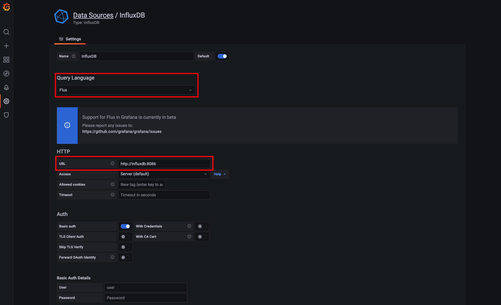

# Jenkins + JMeter + InfluxDB + Grafana

打造具有`极致体验`的`性能测试解决方案`

Tips: 
1. 测试集群采用`Rancher`+`MetalLB`+`NFS Subdir External Provisioner`实现，居家必备；
2. 除上述服务器资源外，还会使用`3`x`10G`的Disk资源作为持久化卷，这里使用家庭`NAS`作为`NFS`服务；

## 一键部署

---

- 一键执行

```shell
kubectl apply -f all-in-one/perf.yaml
```

日志打印如下

```text
namespace/perf-stack created
configmap/grafana created
persistentvolumeclaim/grafana created
deployment.apps/grafana created
service/grafana created
ingress.networking.k8s.io/grafana created
persistentvolumeclaim/influxdb created
deployment.apps/influxdb created
service/influxdb created
ingress.networking.k8s.io/influxdb created
persistentvolumeclaim/jenkins created
deployment.apps/jenkins created
service/jenkins created
ingress.networking.k8s.io/jenkins created
deployment.apps/jmeter-server created
service/jmeter-server created
deployment.apps/jmeter-in-k8s created
```

---

- 查看`Pod`状态

```shell
kubectl get pod -n perf-stack
```

日志打印如下

```text
NAME                             READY   STATUS              RESTARTS   AGE
grafana-697d94fdb8-pgqsx         1/1     Running             0          3m51s
influxdb-66bdff8c9c-6gwpq        1/1     Running             0          3m50s
jenkins-67778bf489-tjh6w         1/1     Running             0          3m50s
jmeter-in-k8s-77948d47d8-99zcc   1/1     Running             0          3m50s
jmeter-server-5dc9866755-cbn4z   1/1     Running             0          3m50s
jmeter-server-5dc9866755-nltcv   1/1     Running             0          3m50s
jmeter-server-5dc9866755-ptkt6   1/1     Running             0          3m50s
```

- 查看`Service`状态

```shell
kubectl get svc -n perf-stack
```

日志打印如下

```text
NAME            TYPE           CLUSTER-IP      EXTERNAL-IP       PORT(S)          AGE
grafana         LoadBalancer   10.43.224.160   192.168.100.150   3000:30167/TCP   6m9s
influxdb        LoadBalancer   10.43.4.226     192.168.100.151   8086:31847/TCP   6m8s
jenkins         LoadBalancer   10.43.187.62    192.168.100.152   8080:30871/TCP   6m8s
jmeter-server   NodePort       10.43.229.221   <none>            1234:31234/TCP   6m8s
```

- 查看`Ingress`状态

```shell
kubectl get ingress -n perf-stack
```

日志打印如下

```text
NAME       CLASS    HOSTS               ADDRESS                                        PORTS   AGE
grafana    <none>   grafana.perf.com    192.168.100.22,192.168.100.23,192.168.100.24   80      8m14s
influxdb   <none>   influxdb.perf.com   192.168.100.22,192.168.100.23,192.168.100.24   80      8m13s
jenkins    <none>   jenkins.perf.com    192.168.100.22,192.168.100.23,192.168.100.24   80      8m13s
```

### 配置域名解析

在 本地`Hosts` 或 组织内的`DNS管理平台` 或 软件`SwitchHosts!` 或 路由器`自定义HOST` 一类的地方配置域名解析即可

```text
192.168.100.22 grafana.perf.com
192.168.100.22 influxdb.perf.com
192.168.100.22 jenkins.perf.com
```

备注: ip随便选哪个都可以~


## 软件设置

---

### InfluxDB

点击[http://influxdb.perf.com/](http://influxdb.perf.com/)

如下图填写您的初始化信息。注意: `Bucket`即后面将会使用到的数据库。


记住这里怎么取Token，待会儿下面会用到。


---

### Grafana

点击[http://grafana.perf.com/](http://grafana.perf.com/)

初始账号密码如下，首次登陆会要求修改密码。注意，记住你修改后的密码哟～

```text
账号: admin
密码: admin
```

添加第一步中配置的InfluxDB数据源。

操作路径: `Configuration(左侧边栏齿轮图标)` -> `Data Sources` -> `InfluxDB(第3个图标)`

如下图进行配置。注意: 这里的URL使用`influxdb:8086`的形式。




导入[官方看板](https://grafana.com/grafana/dashboards/?dataSource=influxdb&search=JMeter)

这里选择`JMeter Load Test`作为数据看板,通过ID`1152`进行导入。


---

### JMeter

#### 集群外使用

通常在办公网环境使用，本地(笔记本/PC)JMeter作为节点控制器，远程(服务器集群)工作节点作为施压机，形成多机分布式性能测试架构。


👷施工中...

#### 集群内使用

👷施工中...

---

### Jenkins

👷施工中...
