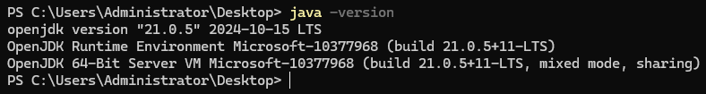

# 如何在本地电脑上搭建 JMeter 性能测试环境


## 1. 安装 Java

由于 JMeter 是基于 Java 的应用程序，因此需要先安装 Java 运行环境（JRE 或 JDK）。

1. **检查是否已安装 Java**

   打开终端或命令提示符，运行以下命令：

   ```bash
   java -version
   ```

   如果显示 Java 版本信息，说明已安装；否则需要安装。

   

2. **下载并安装 Java**

   - 访问 [Oracle JDK](https://www.oracle.com/java/technologies/javase-downloads.html) 或 [OpenJDK](https://openjdk.org/) 下载适合你操作系统的 JDK。（注意：询问您所在的组织或公司，是否允许使用该来源的软件）

   - 安装 JDK，并配置环境变量：

      - **Windows**

         将 JDK 的 `bin` 目录添加到系统环境变量 `PATH` 中。

         例如：C:\Program Files\openjdk\jdk-23.0.1

         1. 在系统环境变量新增 `JAVA_HOME` 为 `C:\Program Files\openjdk\jdk-23.0.1`；

         2. 编辑系统环境变量，将 `%JAVA_HOME%\bin` 加入到 `PATH` 中。

      - **Linux/macOS**

         编辑 `~/.bashrc` 或 `~/.zshrc` 文件，添加以下内容：

         ```bash
         export JAVA_HOME=/path/to/jdk
         export PATH=$JAVA_HOME/bin:$PATH
         ```

         然后运行 `source ~/.bashrc` 或 `source ~/.zshrc` 使配置生效。


## 2. 下载并安装 JMeter

1. **下载 JMeter**

   访问 [Apache JMeter 官网](https://jmeter.apache.org/download_jmeter.cgi) 下载最新版本的二进制包（通常是 `.zip` 或 `.tgz` 文件）。

2. **解压 JMeter**

   将下载的文件解压到本地目录。例如：

   - **Windows**：解压到 `C:\JMeter`。

   - **Linux/macOS**：解压到 `/opt/JMeter` 或 `~/JMeter`。

3. **配置环境变量（可选）**

   为了方便使用，可以将 JMeter 的 `bin` 目录添加到系统环境变量 `PATH` 中：

   - **Windows**

      将 `C:\JMeter\apache-jmeter-5.6.2\bin` 添加到 `PATH`。

   - **Linux/macOS**

      编辑 `~/.bashrc` 或 `~/.zshrc` 文件，添加以下内容：

      ```bash
      export JMETER_HOME=/path/to/jmeter
      export PATH=$JMETER_HOME/bin:$PATH
      ```

      然后运行 `source ~/.bashrc` 或 `source ~/.zshrc` 使配置生效。


## 3. 启动 JMeter

1. **启动 JMeter GUI 模式**

   - **Windows**

      进入 JMeter 的 `bin` 目录，双击 `jmeter.bat` 文件。

   - **Linux/macOS**

      在终端中运行以下命令：

      ```bash
      jmeter
      ```

2. **启动 JMeter 非 GUI 模式（命令行模式）**

   如果需要通过命令行运行测试，可以使用以下命令：

   ```bash
   jmeter -n -t test_plan.jmx -l result.jtl
   ```

   - `-n`：非 GUI 模式。
   - `-t`：指定测试计划文件（`.jmx`）。
   - `-l`：指定结果文件（`.jtl`）。


## 4. 创建和运行测试计划

1. **创建测试计划**

   - 打开 JMeter GUI，右键点击 `Test Plan`，选择 `Add > Threads (Users) > Thread Group`。

   - 在线程组中，右键点击 `Add > Sampler > HTTP Request`，配置请求的 URL 和参数。

   - 右键点击 `Thread Group`，选择 `Add > Listener > View Results Tree` 或 `View Results in Table`，用于查看测试结果。

2. **保存测试计划**

   点击 `File > Save Test Plan As...`，将测试计划保存为 `.jmx` 文件。

3. **运行测试**

   点击工具栏上的绿色启动按钮（或按 `Ctrl + R`）开始测试。

## 5. 安装插件（可选）

JMeter 支持通过插件扩展功能。可以通过 [JMeter Plugins Manager](https://jmeter-plugins.org/) 安装插件。

1. **下载 Plugins Manager**

   访问 [Plugins Manager 下载页面](https://jmeter-plugins.org/wiki/PluginsManager/)，下载 `jmeter-plugins-manager.jar` 文件。

2. **安装 Plugins Manager**

   将下载的 `.jar` 文件放入 JMeter 的 `lib/ext` 目录中。

3. **启动 JMeter**

   启动 JMeter 后，点击 `Options > Plugins Manager`，选择需要的插件并安装。


## 6. 验证环境

1. **运行示例测试**

   创建一个简单的 HTTP 请求测试计划，确保 JMeter 能够正常运行并生成结果。

2. **查看结果**

   在 `View Results Tree` 或 `View Results in Table` 中查看测试结果，确保数据正确。

---

通过以上步骤，你可以在本地电脑上成功搭建 JMeter 性能测试环境，并开始进行性能测试。
